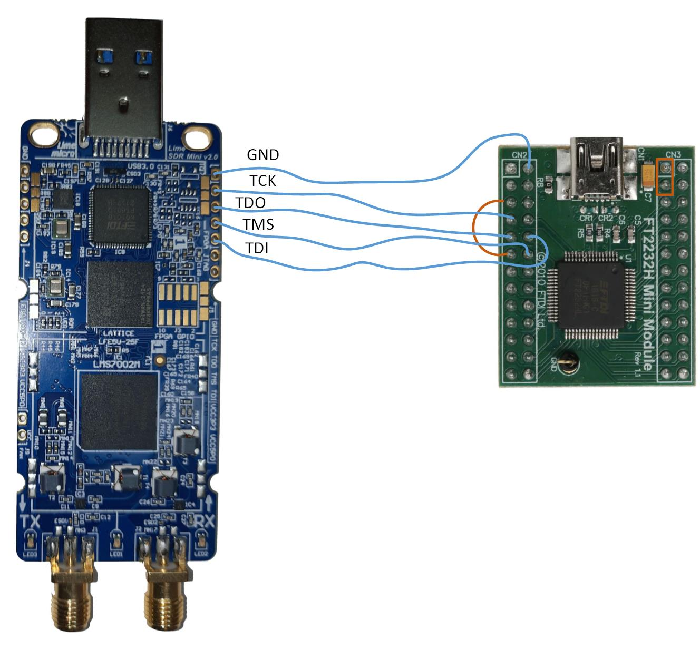
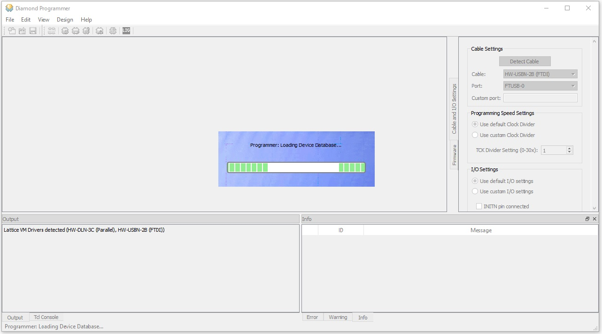
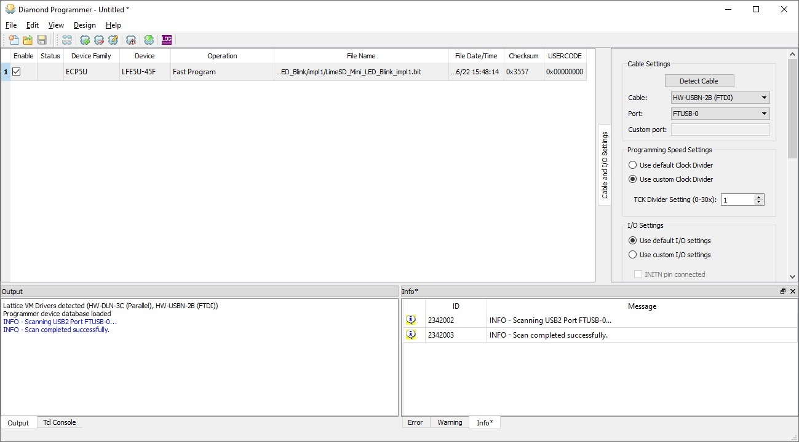
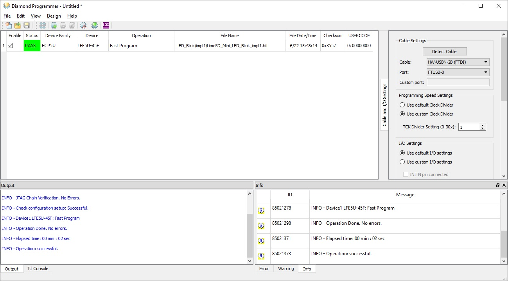
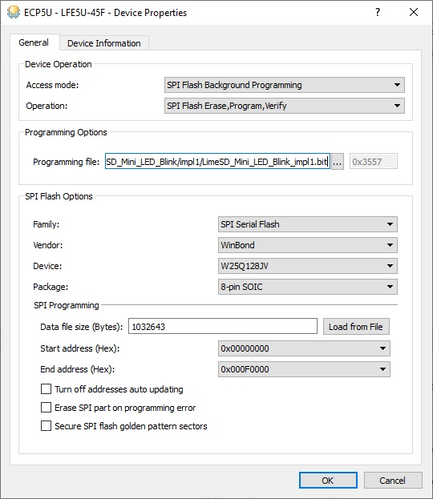
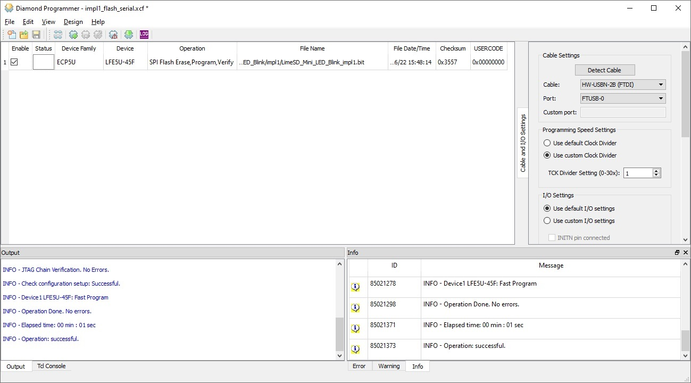
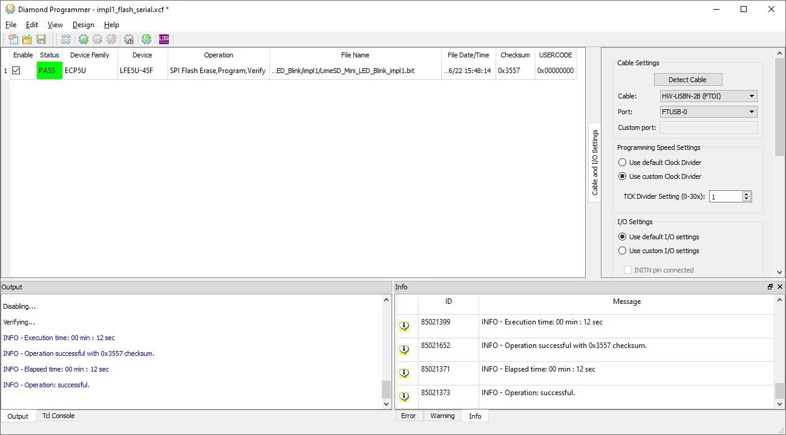

.. _target3:

JTAG Programming
================

This section describes how to program the Lattice LFE5U FPGA used on the LimeSDR Mini v2 board using JTAG interface, FT2232H Mini Module and Lattice software.

Used software
-------------

List of used software is given in Table 1.

.. table:: Table 1. Required software and tools

  +------------------------------------------------------------------------------------------------------------------------------------------------+-------------------------------+------------------------------------------------------------------------------------+
  | **Tool**                                                                                                                                       | **Version**                   | **Comment**                                                                        |
  +================================================================================================================================================+===============================+====================================================================================+
  | `Lattice Diamond Programmer 3.12 SP1 <https://www.latticesemi.com/view_document?document_id=53375>`__                                          | 3.12 SP1                      | Standalone programing software for 64-bit Windows OS. Also available for Linux OS. |
  +------------------------------------------------------------------------------------------------------------------------------------------------+-------------------------------+------------------------------------------------------------------------------------+
  | `Lattice Diamond 3.12 <https://www.latticesemi.com/latticediamond>`__                                                                          | Production Build 3.12.0.240.2 | FPGA design and programming software                                               |
  +------------------------------------------------------------------------------------------------------------------------------------------------+-------------------------------+------------------------------------------------------------------------------------+
  | `Lattice Diamond 3.12 SP1 <https://www.latticesemi.com/latticediamond>`__                                                                      | Build 3.12.1.454.2            | Update for Lattice Diamond (Optional)                                              |
  +------------------------------------------------------------------------------------------------------------------------------------------------+-------------------------------+------------------------------------------------------------------------------------+
  | `LatticeMico System for Diamond 3.12 <https://www.latticesemi.com/en/Products/DesignSoftwareAndIP/EmbeddedDesignSoftware/LatticeMicoSystem>`__ | 1.1                           | Mico32 CPU integration tool (Optional)                                             |
  +------------------------------------------------------------------------------------------------------------------------------------------------+-------------------------------+------------------------------------------------------------------------------------+

Connecting LimeSDR Mini v2 board to FT2232H Mini Module
-------------------------------------------------------

FTDI FT2232H Mini Module is available for approximately $20 from distributors like Digi-Key and Mouser, and it can be used directly as a programming adapter for Lattice devices (and others) by following the setup described below. JTAG is a 4-wire protocol defined by the IEEE (Std 1149.1-2013). The signals that comprise the Test Access Port (TAP) are TCK, TMS, TDI, and TDO. The FT2232H is a two port bridge device and either port can be used for JTAG. Our configuration makes use of bus/port A (0).

FT2232H Mini Module preparation:

* Connect CN3-1 to CN3-3, which connects USB VBUS to VCC (voltage regulator input). This can be done using jumper.
* Connect CN2-5 (or CN2-1/CN2-3)) to CN2-11, which ties V3V3 to VIO on FTDI device.
* Connect LimeSDR Mini v2 to FT2232H Mini module as specified in Table 2 (see Figure 1 for graphical representation).

.. table:: Table 2. LimeSDR Mini board and FT2232H Mini module connections

  +------------------------------------+---------------------------------+
  | **LimeSDR Mini v2**                | **FT2232H Mini module**         |
  +====================================+=================================+
  | J5-1 (GND)                         | CN2-2 (GND)                     |
  +------------------------------------+---------------------------------+
  | J5-2 (FPGA_JTAG_TCK)               | CN2-7 (AD0)                     |
  +------------------------------------+---------------------------------+
  | J5-3 (FPGA_JTAG_TDO)               | CN2-9 (AD2)                     |
  +------------------------------------+---------------------------------+
  | J5-4 (FPGA_JTAG_TMS)               | CN2-12 (AD3)                    |
  +------------------------------------+---------------------------------+
  | J5-5 (FPGA_JTAG_TDI)               | CN2-10 (AD1)                    |
  +------------------------------------+---------------------------------+

  
  Figure 1: LimeSDR Mini v2 board and FT2232H Mini module connections

FPGA programming using Lattice Diamond Programmer software
----------------------------------------------------------

Creating a new project
~~~~~~~~~~~~~~~~~~~~~~

Connect LimesdSDR Mini v2 board to FTDI FT2232H Mini Module as described in paragraph above and connect them to PC via USB ports. Launch software "Lattice Diamond Programmer". Cable HW-USBN-2B (FTDI) and port FTUSB-0 must be selected, as shown in Figure 2.

.. figure:: images/Creating_project_1.jpg
  :width: 600
  
  Figure 2: Cable and port selection

Select an action "Create a new project from JTAG scan" and press "OK" button. Device database loading and JTAG scanning procedures will start, as shown in Figure 3.

  
  Figure 3: Device database loading and JTAG scanning procedure

After successful JTAG chain scan ECP5U family FPGA device will be detected (in this case LFE5U-45F), as shown in Figure 4.

.. figure:: images/Creating_project_3.jpg
  :width: 600
  
  Figure 4: Detected FPGA device

RAM programming
~~~~~~~~~~~~~~~

In context menu press "Edit -> Device properties" and set device operation parameters as shown in Figure 5. Also load appropriate programming file (gateware, bitstream) and then press "OK".

.. figure:: images/RAM_programming_1.jpg
  :width: 600
  
  Figure 5: Device operation parameters and programming file

The main program window should look as shown in Figure 6.

  
  Figure 6: Main program window

In context menu press "Design -> Program" and RAM programming procedure will start, as shown in Figure 7.

.. figure:: images/RAM_programming_3.jpg
  :width: 600
  
  Figure 7: Programming procedure

After successful programming operation "Status" field will change to "PASS" highlihted in green as shown in Figure 8 and FPGA will start execution of a new gateware.

  
  Figure 8: Successful programming result

Flash programming
~~~~~~~~~~~~~~~~~

**IMPORTANT!** Backgroud programming has to be enabled first by programming `lms7_trx_preflash_gw.bit <https://github.com/myriadrf/LimeSDR-Mini-v2_GW/blob/main/LimeSDR-Mini_bitstreams/lms7_trx_preflash_gw.bit>`__ file with "RAM programing" procedure.

In context menu press "Edit -> Device properties" and in section "Device Operation" set "Access mode" to "SPI Flash Background Programming" and "Operation" to "SPI Flash Erase,Program,Verify".

Load appropriate programming file (gateware, bitstream) and set the remaining parameters for Winbond W25Q128JV flash memory as shown in the image below and then press "OK".

  
  Figure 8: LimeSDR Mini v2 board and FT2232H Mini module connections

The main program window should look like shown in figure 9.

  
  Figure 9: Main program window

In context menu press "Design -> Program" and Flash programming procedure will start, as shown in Figure 10.

.. figure:: images/Flash_programming_3.jpg
  :width: 600
  
  Figure 10: Flash in progress

After successful programming operation "Status" field will change to "PASS" highlihted in green as shown in Figure 11 and FPGA will start execution of a new gateware.

  
  Figure 11: Successful programming

You can now save project for future use by selecting menu item "File -> Save".

FPGA programming using Lattice Diamond software
-----------------------------------------------

Open .ldf project File->Open->Project...

**FPGA SRAM programming**

* Open programmer setup file: ./LimeSDR-Mini_bitstreams/impl1_sram.xcf
* Select .bit file : ./LimeSDR-Mini_bitstreams/lms7_trx_impl1.bit
* Click Program.
* You should see blinking LED1 in green colour. 

**FPGA FLASH programming**

First program bitstream file to enable background programming:

* Open programmer setup file: ./LimeSDR-Mini_bitstreams/impl1_sram.xcf
* Select .bit file : ./LimeSDR-Mini_bitstreams/lms7_trx_preflash_gw.bit
* Click Program

Program Flash:

* Open programmer setup file: ./LimeSDR-Mini_bitstreams/impl1_flash_dualboot.xcf
* Select .mcs file : ./LimeSDR-Mini_bitstreams/lms7_trx_impl1_dualboot.mcs
* Click Program
* You should see blinking LED after reapplying power to board
