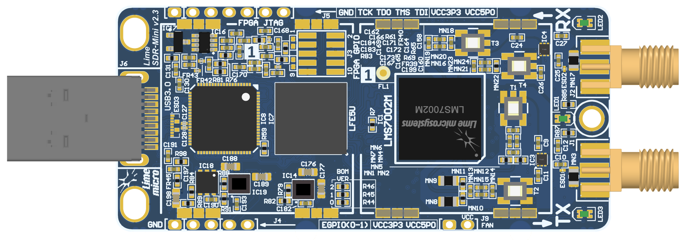
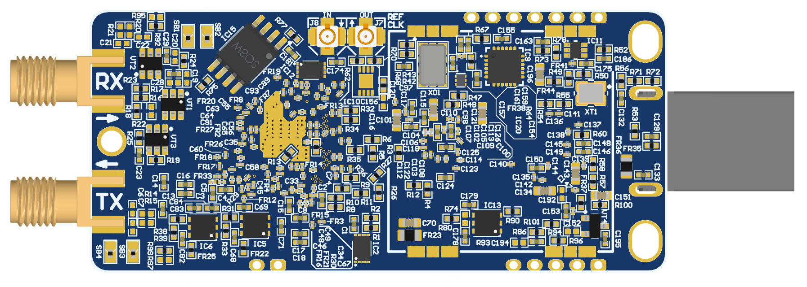
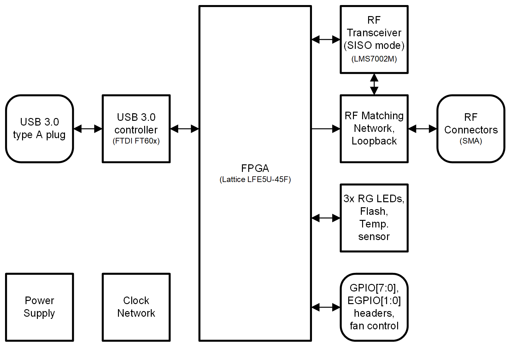
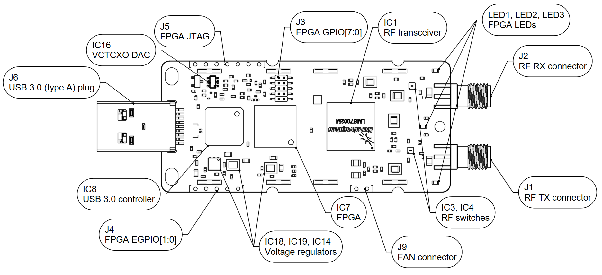
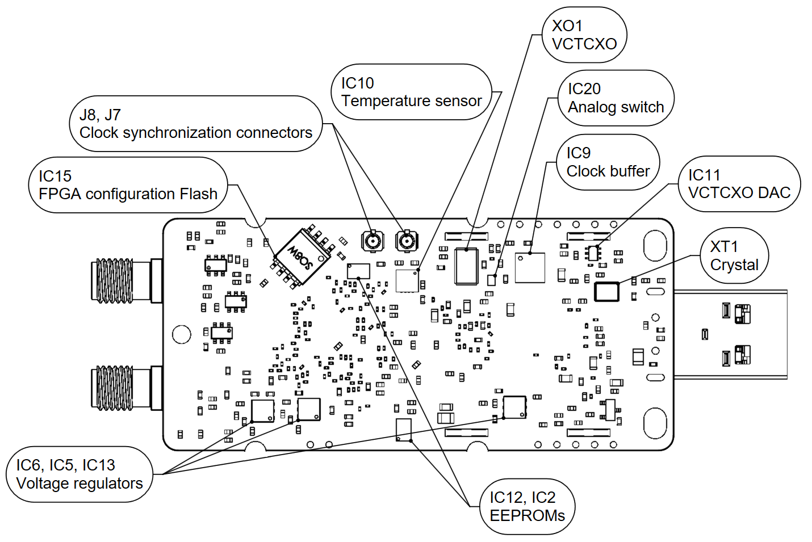
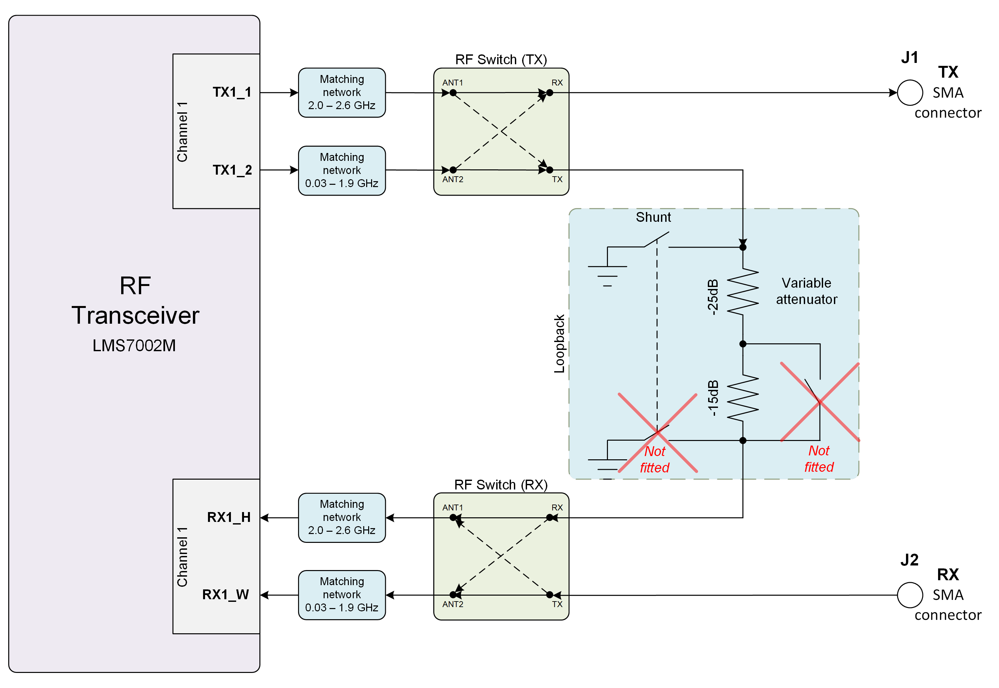
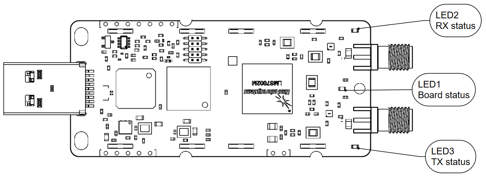
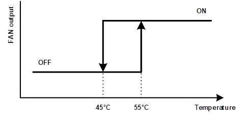
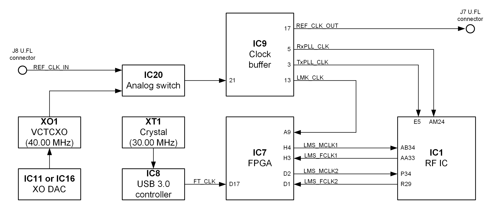
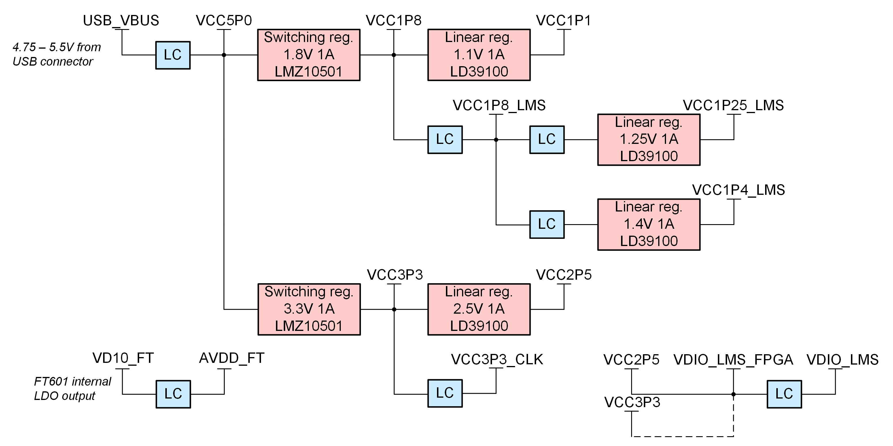

***********************
LimeSDR Mini v2.3 Board
***********************

Introduction
============

LimeSDR Mini v2.3 Board Key Features
------------------------------------

The LimeSDR-Mini is low-cost software defined radio board. LimeSDR-Mini development board provides a hardware platform for developing and prototyping high-performance and logic-intensive digital and RF designs based on Lattice Semiconductor’s ECP5 FPGA and Lime Microsystems transceiver

  
  Figure 1: LimeSDR Mini v2.3 board top view

  
  Figure 2: LimeSDR Mini v2.3 board bottom view

LimeSDR Mini board features:

* RF and BB parameters:

  * Configuration: SISO (1x TX, 1x RX)
  * Frequency range: 10 MHz – 3.5 GHz
  * Bandwidth: 30.72 MHz
  * Sample depth: 12 bit
  * Sample rate: 30.72 MSPS
  * Transmit power: max 10 dBm (depending on frequency)

* USB 3.0 controller: FTDI FT601

* FPGA: board is designed for Lattice ECP5 family LFE5U-25F/LFE5U-45F/LFE5U-85F FPGAs in 285-ball csfBGA package. By default board is assembled with LFE5U-45F-MG285 FPGA. Lattice ECP5 LFE5U-45F features:

  * 285-pin csfBGA package (10 x 10 mm, 0.5 mm)
  * 44 K LUTs logic capacity
  * 108 sysMEM Blocks (18 Kb)
  * 1944 Kb Embedded Memory
  * 351 Kb distributed RAM
  * 72x 18x18-bit multipliers
  * 4x PLLs and 4x DLLs
  * 118 IOs
  * FPGA configuration via JTAG
	
* RF transceiver: Lime Microsystems LMS7002M

* EEPROM Memory: 2x 128Kb EEPROMs for LMS MCU firmware and FPGA data (optional)

* FLASH Memory: 128Mb Flash memory for FPGA configuration

* Temperature sensor: LM75

* General user inputs/outputs:

  * 3x Dual colour (RG) LEDs
  * 8x + 2x FPGA GPIO pinheaders (3.3V) (optional)

* Connections:

  * USB 3.0 (type A) plug
  * Coaxial RF (SMA female) connectors
  * FPGA GPIO headers (unpopulated)
  * FPGA JTAG connector (unpopulated)
  * FAN (5V default or 3.3V) connector

* Clock system:

  * 40.00MHz on board VCTCXO
  * VCTCXO can be tuned by onboard DAC
  * Reference clock input and output connectors (U.FL)
  * Analog switch for clock source selection

* Board size: 69mm x 31.4mm

* Board power source: USB connector (5V)

For more information on the following topics, refer to the corresponding documents:

* `FTDI FT601 USB 3.0 to FIFO Bridge datasheet <https://ftdichip.com/wp-content/uploads/2020/07/DS_FT600Q-FT601Q-IC-Datasheet.pdf>`_
* `Lattice ECP5 and ECP5-5G Family data sheet <https://www.latticesemi.com/view_document?document_id=50461>`_
* `Lime Microsystems LMS7002M transceiver datasheet <https://limemicro.com/silicon/lms7002m/>`_

Board Overview
--------------

The heart of the LimeSDR-Mini board is Lattice ECP5 (LFE5U-45F) FPGA. 
It’s main function is to transfer digital data between the PC through a USB 3.0 connector. 
The block diagram for LimeSDR-Mini board is presented in the Figure

  
  Figure 3: LimeSDR Mini v2.3 Development Board Block Diagram

This section contains component location description on the board. 
LimeSDR-Mini board picture with highlighted connectors and main components is presented in Figure 4 and Figure 5. 

.. _target2:

  
  Figure 4: LimeSDR Mini v2.3 board top connectors and main components

  
  Figure 5: LimeSDR Mini v2.3 board bottom connectors and main components

Description of board components is given in the Table 1.

.. table:: Table 1. Board components

   +------------------------------------------------------------------------------------------------------------------------------------+
   | **Featured   Devices**                                                                                                             |
   +------------------+-------------------------+---------------------------------------------------------------------------------------+
   | Board Reference  | Type                    | Description                                                                           |
   +------------------+-------------------------+---------------------------------------------------------------------------------------+
   | IC1              | RF transceiver          | Lime Microsystems   LMS7002M                                                          |
   +------------------+-------------------------+---------------------------------------------------------------------------------------+
   | IC7              | FPGA                    | Lattice   Semiconductor’s LFE5U (LFE5U-45F)                                           |
   +------------------+-------------------------+---------------------------------------------------------------------------------------+
   | IC8              | USB 3.0 microcontroller | FTDI USB 3.0 to FIFO interface bridge chip   FT601                                    |
   +------------------+-------------------------+---------------------------------------------------------------------------------------+
   | **Miscellaneous   devices**                                                                                                        |
   +------------------+-------------------------+---------------------------------------------------------------------------------------+
   | IC10             | IC                      | Temperature sensor LM75                                                               |
   +------------------+-------------------------+---------------------------------------------------------------------------------------+
   | **Configuration,   Status and Setup Elements**                                                                                     |
   +------------------+-------------------------+---------------------------------------------------------------------------------------+
   | J5               | JTAG chain connector    | FPGA programming pin header on the board edge   for JTAG cable, 0.1” pitch            |
   +------------------+-------------------------+---------------------------------------------------------------------------------------+
   | LED1, LED2, LED3 | Red-green status LEDs   | User defined FPGA indication LED.                                                     |
   +------------------+-------------------------+---------------------------------------------------------------------------------------+
   | **General   User Input/Output**                                                                                                    |
   +------------------+-------------------------+---------------------------------------------------------------------------------------+
   | J3               | Pin header              | 8x FPGA GPIOs, 3.3V, 0.05” pitch                                                      |
   +------------------+-------------------------+---------------------------------------------------------------------------------------+
   | J4               | Pin header              | 2x FPGA GPIOs on the board edge, 3.3V, 0.1”   pitch                                   |
   +------------------+-------------------------+---------------------------------------------------------------------------------------+
   | J9               | Pin header              | 5V (3.3V voltage can be chosen by resistors)   fan connection pin headers, 0.1” pitch |
   +------------------+-------------------------+---------------------------------------------------------------------------------------+
   | **Memory   Devices**                                                                                                               |
   +------------------+-------------------------+---------------------------------------------------------------------------------------+
   | IC2              | IC                      | I²C EEPROM Memory 128Kb (16 x 8), connected   to RF transceiver I2C bus               |
   +------------------+-------------------------+---------------------------------------------------------------------------------------+
   | IC12             | IC                      | I²C EEPROM Memory 128Kb (16K x 8), connected   to FPGA I2C bus                        |
   +------------------+-------------------------+---------------------------------------------------------------------------------------+
   | IC15             | IC                      | Quad SPI Flash Memory 128 Mb (16M x 8)   connected to FPGA SPI                        |
   +------------------+-------------------------+---------------------------------------------------------------------------------------+
   | **Communication   Ports**                                                                                                          |
   +------------------+-------------------------+---------------------------------------------------------------------------------------+
   | J6               | USB 3.0 connector       | USB 3.0 (type A) plug                                                                 |
   +------------------+-------------------------+---------------------------------------------------------------------------------------+
   | **Clock   Circuitry**                                                                                                              |
   +------------------+-------------------------+---------------------------------------------------------------------------------------+
   | XO1              | VCTCXO                  | 40.00 MHz Voltage Controlled Temperature   Compensated Crystal Oscillator             |
   +------------------+-------------------------+---------------------------------------------------------------------------------------+
   | IC11             | IC                      | 10 bit DAC for TCXO (XT4) frequency tuning   (default)                                |
   +------------------+-------------------------+---------------------------------------------------------------------------------------+
   | IC16             | IC                      | 16 bit DAC for TCXO (XT4) frequency tuning   (unpopulated)                            |
   +------------------+-------------------------+---------------------------------------------------------------------------------------+
   | IC17             | IC                      | Voltage reference (unpopulated)                                                       |
   +------------------+-------------------------+---------------------------------------------------------------------------------------+
   | IC9              | IC                      | Clock buffer                                                                          |
   +------------------+-------------------------+---------------------------------------------------------------------------------------+
   | IC20             | IC                      | Analog switch                                                                         |
   +------------------+-------------------------+---------------------------------------------------------------------------------------+
   | J8               | U.FL connector          | Reference clock input                                                                 |
   +------------------+-------------------------+---------------------------------------------------------------------------------------+
   | J7               | U.FL connector          | Reference clock output                                                                |
   +------------------+-------------------------+---------------------------------------------------------------------------------------+
   | **Power   Supply**                                                                                                                 |
   +------------------+-------------------------+---------------------------------------------------------------------------------------+
   | IC14             | IC                      | Switching regulator LMZ10501 (1.8V rail)                                              |
   +------------------+-------------------------+---------------------------------------------------------------------------------------+
   | IC19             | IC                      | Switching regulator LMZ10501 (3.3V rail)                                              |
   +------------------+-------------------------+---------------------------------------------------------------------------------------+
   | IC13             | IC                      | Linear regulator LD39100PUR (1.1V rail)                                               |
   +------------------+-------------------------+---------------------------------------------------------------------------------------+
   | IC5              | IC                      | Linear regulator LD39100PUR (1.25V rail)                                              |
   +------------------+-------------------------+---------------------------------------------------------------------------------------+
   | IC6              | IC                      | Linear regulator LD39100PUR (1.4V rail)                                               |
   +------------------+-------------------------+---------------------------------------------------------------------------------------+
   | IC18             | IC                      | Linear regulator LD39100PUR (2.5V rail)                                               |
   +------------------+-------------------------+---------------------------------------------------------------------------------------+

Board Description
=================

More detailed description of LimeSDR-Mini board components and interconnections is given in the sections of this chapter.

RF transceiver digital connectivity
-----------------------------------

The interface and control signals are described below:

* Digital Interface Signals: LENS7002 is using data bus LIMNS_DIQ1_D[11:0] and LMS_DIQ2_D[11:0], LMS_EN_IQSEL1 and LMS_EN_IQSEL2, LMS_FCLK1 and LMS_FCLK2, LMS_MCLK1 and LMS_MCLK2 signals to transfer data to/from FPGA. Indexes 1 and 2 indicate transceiver digital data PORT-1 or PORT-2. Any of these ports can be used to transmit or receive data. By default PORT-1 is selected as transmit port and PORT-2 is selected as receiver port. The FCLK# is input clock and MCLK# is output clock for LMS7002M transceiver. TXNRX signals sets ports directions. For LMS7002M interface timing details refer to `LMS7002M transceiver datasheet <https://limemicro.com/silicon/lms7002m/>`_ page 12-13.
* LMS Control Signals: these signals are used for optional functionality:
  
  * LMS_RXEN, LMS_TXEN – receiver and transmitter enable/disable signals connected to FPGA Bank 8 (VDIO_LMS_FPGA; 2.5V).
  * LMS_RESET – LMS7002M reset connected to FPGA Bank 3 (VDIO_LMS_FPGA; 2.5V).

* SPI Interface: LMS7002M transceiver is configured via 4-wire SPI interface; FPGA_SPI_SCLK, FPGA_SPI_MOSI, FPGA_SPI_MISO, FPGA_SPI_LMS_SS. The SPI interface controlled from FPGA Bank 3 (VDIO_LMS_FPGA; 2.5V). 
* LMS I2C Interface: can be used for LMS EEPROM content modifying or for debug purposes. The signals LMS_I2C_SCL, LMS_I2C_DATA connected to EEPROM.

.. table:: Table 2. RF transceiver (LMS7002) digital interface pins

   +--------------------+--------------------------+---------------------------+--------------+-----------------------+--------------------------------+
   | **Chip pin (IC1)** | **Chip reference (IC1)** | **Schematic signal name** | **FPGA pin** | **FPGA I/O standard** | **FPGA I/O standard**          |
   +--------------------+--------------------------+---------------------------+--------------+-----------------------+--------------------------------+
   | E5                 | xoscin_tx                | TxPLL_CLK                 |              |                       | Connected to   40.00 MHz clock |
   +--------------------+--------------------------+---------------------------+--------------+-----------------------+--------------------------------+
   | AB34               | MCLK1                    | LMS_MCLK1                 | H4           | 2.5V/3.3V             |                                |
   +--------------------+--------------------------+---------------------------+--------------+-----------------------+--------------------------------+
   | AA33               | FCLK1                    | LMS_FCLK1                 | H3           | 2.5V/3.3V             |                                |
   +--------------------+--------------------------+---------------------------+--------------+-----------------------+--------------------------------+
   | V32                | TXNRX1                   | LMS_TXNRX1                | F1           | 2.5V/3.3V             |                                |
   +--------------------+--------------------------+---------------------------+--------------+-----------------------+--------------------------------+
   | U29                | TXEN                     | LMS_TXEN                  | B7           | 2.5V/3.3V             |                                |
   +--------------------+--------------------------+---------------------------+--------------+-----------------------+--------------------------------+
   | 1Y32               | ENABLE_IQSEL1            | LMS_EN_IQSEL1             | F3           | 2.5V/3.3V             |                                |
   +--------------------+--------------------------+---------------------------+--------------+-----------------------+--------------------------------+
   | AG31               | DIQ1_D0                  | LMS_DIQ1_D0               | J2           | 2.5V/3.3V             |                                |
   +--------------------+--------------------------+---------------------------+--------------+-----------------------+--------------------------------+
   | AF30               | DIQ1_D1                  | LMS_DIQ1_D1               | L1           | 2.5V/3.3V             |                                |
   +--------------------+--------------------------+---------------------------+--------------+-----------------------+--------------------------------+
   | AF34               | DIQ1_D2                  | LMS_DIQ1_D2               | K1           | 2.5V/3.3V             |                                |
   +--------------------+--------------------------+---------------------------+--------------+-----------------------+--------------------------------+
   | AE31               | DIQ1_D3                  | LMS_DIQ1_D3               | K4           | 2.5V/3.3V             |                                |
   +--------------------+--------------------------+---------------------------+--------------+-----------------------+--------------------------------+
   | AD30               | DIQ1_D4                  | LMS_DIQ1_D4               | G3           | 2.5V/3.3V             |                                |
   +--------------------+--------------------------+---------------------------+--------------+-----------------------+--------------------------------+
   | AC29               | DIQ1_D5                  | LMS_DIQ1_D5               | F4           | 2.5V/3.3V             |                                |
   +--------------------+--------------------------+---------------------------+--------------+-----------------------+--------------------------------+
   | AE33               | DIQ1_D6                  | LMS_DIQ1_D6               | J1           | 2.5V/3.3V             |                                |
   +--------------------+--------------------------+---------------------------+--------------+-----------------------+--------------------------------+
   | AD32               | DIQ1_D7                  | LMS_DIQ1_D7               | H1           | 2.5V/3.3V             |                                |
   +--------------------+--------------------------+---------------------------+--------------+-----------------------+--------------------------------+
   | AC31               | DIQ1_D8                  | LMS_DIQ1_D8               | G4           | 2.5V/3.3V             |                                |
   +--------------------+--------------------------+---------------------------+--------------+-----------------------+--------------------------------+
   | AC33               | DIQ1_D9                  | LMS_DIQ1_D9               | F2           | 2.5V/3.3V             |                                |
   +--------------------+--------------------------+---------------------------+--------------+-----------------------+--------------------------------+
   | AB30               | DIQ1_D10                 | LMS_DIQ1_D10              | G1           | 2.5V/3.3V             |                                |
   +--------------------+--------------------------+---------------------------+--------------+-----------------------+--------------------------------+
   | AB32               | DIQ1_D11                 | LMS_DIQ1_D11              | H2           | 2.5V/3.3V             |                                |
   +--------------------+--------------------------+---------------------------+--------------+-----------------------+--------------------------------+
   | AM24               | xoscin_rx                | RxPLL_CLK                 |              |                       | Connected to   40.00 MHz clock |
   +--------------------+--------------------------+---------------------------+--------------+-----------------------+--------------------------------+
   | P34                | MCLK2                    | LMS_MCLK2                 | D2           | 2.5V/3.3V             |                                |
   +--------------------+--------------------------+---------------------------+--------------+-----------------------+--------------------------------+
   | R29                | FCLK2                    | LMS_FCLK2                 | D1           | 2.5V/3.3V             |                                |
   +--------------------+--------------------------+---------------------------+--------------+-----------------------+--------------------------------+
   | U31                | TXNRX2                   | LMS_TXNRX2                |              |                       |                                |
   +--------------------+--------------------------+---------------------------+--------------+-----------------------+--------------------------------+
   | V34                | RXEN                     | LMS_RXEN                  | D6           | 2.5V/3.3V             |                                |
   +--------------------+--------------------------+---------------------------+--------------+-----------------------+--------------------------------+
   | R33                | ENABLE_IQSEL2            | LMS_EN_IQSEL2             | C4           | 2.5V/3.3V             |                                |
   +--------------------+--------------------------+---------------------------+--------------+-----------------------+--------------------------------+
   | H30                | DIQ2_D0                  | LMS_DIQ2_D0               | A3           | 2.5V/3.3V             |                                |
   +--------------------+--------------------------+---------------------------+--------------+-----------------------+--------------------------------+
   | J31                | DIQ2_D1                  | LMS_DIQ2_D1               | C2           | 2.5V/3.3V             |                                |
   +--------------------+--------------------------+---------------------------+--------------+-----------------------+--------------------------------+
   | K30                | DIQ2_D2                  | LMS_DIQ2_D2               | A2           | 2.5V/3.3V             |                                |
   +--------------------+--------------------------+---------------------------+--------------+-----------------------+--------------------------------+
   | K32                | DIQ2_D3                  | LMS_DIQ2_D3               | B4           | 2.5V/3.3V             |                                |
   +--------------------+--------------------------+---------------------------+--------------+-----------------------+--------------------------------+
   | L31                | DIQ2_D4                  | LMS_DIQ2_D4               | C3           | 2.5V/3.3V             |                                |
   +--------------------+--------------------------+---------------------------+--------------+-----------------------+--------------------------------+
   | K34                | DIQ2_D5                  | LMS_DIQ2_D5               | B2           | 2.5V/3.3V             |                                |
   +--------------------+--------------------------+---------------------------+--------------+-----------------------+--------------------------------+
   | M30                | DIQ2_D6                  | LMS_DIQ2_D6               | D3           | 2.5V/3.3V             |                                |
   +--------------------+--------------------------+---------------------------+--------------+-----------------------+--------------------------------+
   | M32                | DIQ2_D7                  | LMS_DIQ2_D7               | B1           | 2.5V/3.3V             |                                |
   +--------------------+--------------------------+---------------------------+--------------+-----------------------+--------------------------------+
   | N31                | DIQ2_D8                  | LMS_DIQ2_D8               | A4           | 2.5V/3.3V             |                                |
   +--------------------+--------------------------+---------------------------+--------------+-----------------------+--------------------------------+
   | N33                | DIQ2_D9                  | LMS_DIQ2_D9               | C1           | 2.5V/3.3V             |                                |
   +--------------------+--------------------------+---------------------------+--------------+-----------------------+--------------------------------+
   | P30                | DIQ2_D10                 | LMS_DIQ2_D10              | C7           | 2.5V/3.3V             |                                |
   +--------------------+--------------------------+---------------------------+--------------+-----------------------+--------------------------------+
   | P32                | DIQ2_D11                 | LMS_DIQ2_D11              | A6           | 2.5V/3.3V             |                                |
   +--------------------+--------------------------+---------------------------+--------------+-----------------------+--------------------------------+
   | U33                | CORE_LDO_EN              | LMS_CORE_LDO_EN           | C6           | 2.5V/3.3V             |                                |
   +--------------------+--------------------------+---------------------------+--------------+-----------------------+--------------------------------+
   | E27                | RESET                    | LMS_RESET                 | A7           | 2.5V/3.3V             |                                |
   +--------------------+--------------------------+---------------------------+--------------+-----------------------+--------------------------------+
   | D28                | SEN                      | FPGA_SPI_LMS_SS           | N3           | 2.5V/3.3V             | SPI interface                  |
   +--------------------+--------------------------+---------------------------+--------------+-----------------------+--------------------------------+
   | C29                | SCLK                     | FPGA_SPI_SCLK             | M3           | 2.5V/3.3V             | SPI interface                  |
   +--------------------+--------------------------+---------------------------+--------------+-----------------------+--------------------------------+
   | F30                | SDIO                     | FPGA_SPI_MOSI             | L3           | 2.5V/3.3V             | SPI interface                  |
   +--------------------+--------------------------+---------------------------+--------------+-----------------------+--------------------------------+
   | F28                | SDO                      | FPGA_SPI_MISO             | K3           | 2.5V/3.3V             | SPI interface                  |
   +--------------------+--------------------------+---------------------------+--------------+-----------------------+--------------------------------+
   | D26                | SDA                      | LMS_I2C_SDA               |              |                       | Connected to   EEPROM          |
   +--------------------+--------------------------+---------------------------+--------------+-----------------------+--------------------------------+
   | C27                | SCL                      | LMS_I2C_SCL               |              |                       | Connected to   EEPROM          |
   +--------------------+--------------------------+---------------------------+--------------+-----------------------+--------------------------------+

RF path and control signals
---------------------------

LimeSDR-Mini RF path contains matching networks, RF switches, loopback variable attenuator and 2 SMA connectors (J1 - TX and J2 - RX) as shown in Figure 6.

  
  Figure 6: LimeSDR Mini v2.3 RF diagram

RF transceiver TX and RX ports has its dedicated matching network which together determines the working frequency range. More detailed information about RF transceiver ports and matching network frequency ranges is listed in the Table 3.

.. table:: Table 3. RF transceiver ports and matching networks frequency ranges

  +-------------------------------+--------------------------------------+
  | **RF transceiver port**       | **Frequency range**                  |
  +===============================+======================================+
  | TX1_1                         | 2 GHz - 2.6 GHz                      |
  +-------------------------------+--------------------------------------+
  | TX1_2                         | 30 MHz - 1.9 GHz                     |
  +-------------------------------+--------------------------------------+
  | RX1_H                         | 2 GHz - 2.6 GHz                      |
  +-------------------------------+--------------------------------------+
  | RX1_W                         | 700 MHz - 900 MHz                    |
  +-------------------------------+--------------------------------------+

RF path control signals are described in the Table 4.

.. table:: Table 4. RF path control signals

  +------------------------+---------------------------+------------------+--------------+-------------------------------------------------------------------------------------------------+
  | **Component**          | **Schematic signal name** | **I/O standard** | **FPGA pin** | **Description**                                                                                 |
  +========================+===========================+==================+==============+=================================================================================================+
  | RFSW_TX                | RFSW_TX_V1                | 3.3V             | B10          | V1 – high V2- low TX1_1 to TX and TX1_2 to ATT,                                                 |
  |                        |                           |                  |              |                                                                                                 |
  | (SKY13411-374LF – IC3) |                           |                  |              | V1 – low V2 – high TX1_1 to ATT and TX1_2 to TX                                                 |
  +------------------------+---------------------------+------------------+--------------+-------------------------------------------------------------------------------------------------+
  |                        | RFSW_TX_V2                | 3.3V             | C9           |                                                                                                 |
  +------------------------+---------------------------+------------------+--------------+-------------------------------------------------------------------------------------------------+
  | RFSW_RX                | RFSW_RX_V1                | 3.3V             | C11          | V1 – high V2- low RX_H to RX and RX1_W to ATT,                                                  |
  |                        |                           |                  |              |                                                                                                 |
  | (SKY13411-374LF – IC3) |                           |                  |              | V1 – low V2 – high RX1_H to ATT and RX1_W to RX                                                 |
  +------------------------+---------------------------+------------------+--------------+-------------------------------------------------------------------------------------------------+
  |                        | RFSW_RX_V2                | 3.3V             | B11          |                                                                                                 |
  +------------------------+---------------------------+------------------+--------------+-------------------------------------------------------------------------------------------------+
  | Variable attenuator    | TX_LB_AT                  | 3.3V             | C8           | High - -40dB, low - -25dB                                                                       |
  +                        +---------------------------+------------------+--------------+-------------------------------------------------------------------------------------------------+
  |                        | TX_LB_SH                  | 3.3V             | B8           | Attenuator shunting.                                                                            |
  +------------------------+---------------------------+------------------+--------------+-------------------------------------------------------------------------------------------------+

USB 3.0 controller
------------------

Software controls LimeSDR Mini board via the USB 3.0 controller (`FTDI USB 3.0 to FIFO interface bridge chip FT601 <https://ftdichip.com/products/ft600q-b/>`_). The controller signals description showed below:

* FT_D[31:0] – FTDI 32-bit data interface is connected to FPGA.
* FT_TXEn, FT_RXFn, FT_SIWUn, FT_WRn, FT_RDn, FT_OEn, FT_BE[3:0] – FTDI interface control signals.
* FT_CLK – FTDI interface clock. Clock from FTDI is fed to FPGA.

More information about USB 3.0 controller (FTDI) pins, schematic signal names, FPGA interconnections and I/O standards is given in Table 5.

.. table:: Table 5. USB 3.0 controller (FTDI) pins

  +--------------------+--------------------------+---------------------------+--------------+------------------+-------------+
  | **Chip pin (IC6)** | **Chip reference (IC6)** | **Schematic signal name** | **FPGA pin** | **I/O standard** | **Comment** |
  +====================+==========================+===========================+==============+==================+=============+
  | 40                 | DATA_0                   | FT_D0                     | A13          | 3.3V             |             |
  +--------------------+--------------------------+---------------------------+--------------+------------------+-------------+
  | 41                 | DATA_1                   | FT_D1                     | B12          | 3.3V             |             |
  +--------------------+--------------------------+---------------------------+--------------+------------------+-------------+
  | 42                 | DATA_2                   | FT_D2                     | B15          | 3.3V             |             |
  +--------------------+--------------------------+---------------------------+--------------+------------------+-------------+
  | 43                 | DATA_3                   | FT_D3                     | C12          | 3.3V             |             |
  +--------------------+--------------------------+---------------------------+--------------+------------------+-------------+
  | 44                 | DATA_4                   | FT_D4                     | A16          | 3.3V             |             |
  +--------------------+--------------------------+---------------------------+--------------+------------------+-------------+
  | 45                 | DATA_5                   | FT_D5                     | A12          | 3.3V             |             |
  +--------------------+--------------------------+---------------------------+--------------+------------------+-------------+
  | 46                 | DATA_6                   | FT_D6                     | D18          | 3.3V             |             |
  +--------------------+--------------------------+---------------------------+--------------+------------------+-------------+
  | 47                 | DATA_7                   | FT_D7                     | B17          | 3.3V             |             |
  +--------------------+--------------------------+---------------------------+--------------+------------------+-------------+
  | 50                 | DATA_8                   | FT_D8                     | F15          | 3.3V             |             |
  +--------------------+--------------------------+---------------------------+--------------+------------------+-------------+
  | 51                 | DATA_9                   | FT_D9                     | D16          | 3.3V             |             |
  +--------------------+--------------------------+---------------------------+--------------+------------------+-------------+
  | 52                 | DATA_10                  | FT_D10                    | D15          | 3.3V             |             |
  +--------------------+--------------------------+---------------------------+--------------+------------------+-------------+
  | 53                 | DATA_11                  | FT_D11                    | C13          | 3.3V             |             |
  +--------------------+--------------------------+---------------------------+--------------+------------------+-------------+
  | 54                 | DATA_12                  | FT_D12                    | H18          | 3.3V             |             |
  +--------------------+--------------------------+---------------------------+--------------+------------------+-------------+
  | 55                 | DATA_13                  | FT_D13                    | B13          | 3.3V             |             |
  +--------------------+--------------------------+---------------------------+--------------+------------------+-------------+
  | 56                 | DATA_14                  | FT_D14                    | J18          | 3.3V             |             |
  +--------------------+--------------------------+---------------------------+--------------+------------------+-------------+
  | 57                 | DATA_15                  | FT_D15                    | A15          | 3.3V             |             |
  +--------------------+--------------------------+---------------------------+--------------+------------------+-------------+
  | 60                 | DATA_16                  | FT_D16                    | B18          | 3.3V             |             |
  +--------------------+--------------------------+---------------------------+--------------+------------------+-------------+
  | 61                 | DATA_17                  | FT_D17                    | C18          | 3.3V             |             |
  +--------------------+--------------------------+---------------------------+--------------+------------------+-------------+
  | 62                 | DATA_18                  | FT_D18                    | A17          | 3.3V             |             |
  +--------------------+--------------------------+---------------------------+--------------+------------------+-------------+
  | 63                 | DATA_19                  | FT_D19                    | K18          | 3.3V             |             |
  +--------------------+--------------------------+---------------------------+--------------+------------------+-------------+
  | 64                 | DATA_20                  | FT_D20                    | C15          | 3.3V             |             |
  +--------------------+--------------------------+---------------------------+--------------+------------------+-------------+
  | 65                 | DATA_21                  | FT_D21                    | L18          | 3.3V             |             |
  +--------------------+--------------------------+---------------------------+--------------+------------------+-------------+
  | 66                 | DATA_22                  | FT_D22                    | F18          | 3.3V             |             |
  +--------------------+--------------------------+---------------------------+--------------+------------------+-------------+
  | 67                 | DATA_23                  | FT_D23                    | C16          | 3.3V             |             |
  +--------------------+--------------------------+---------------------------+--------------+------------------+-------------+
  | 69                 | DATA_24                  | FT_D24                    | G16          | 3.3V             |             |
  +--------------------+--------------------------+---------------------------+--------------+------------------+-------------+
  | 70                 | DATA_25                  | FT_D25                    | D13          | 3.3V             |             |
  +--------------------+--------------------------+---------------------------+--------------+------------------+-------------+
  | 71                 | DATA_26                  | FT_D26                    | G18          | 3.3V             |             |
  +--------------------+--------------------------+---------------------------+--------------+------------------+-------------+
  | 72                 | DATA_27                  | FT_D27                    | F16          | 3.3V             |             |
  +--------------------+--------------------------+---------------------------+--------------+------------------+-------------+
  | 73                 | DATA_28                  | FT_D28                    | C17          | 3.3V             |             |
  +--------------------+--------------------------+---------------------------+--------------+------------------+-------------+
  | 74                 | DATA_29                  | FT_D29                    | F17          | 3.3V             |             |
  +--------------------+--------------------------+---------------------------+--------------+------------------+-------------+
  | 75                 | DATA_30                  | FT_D30                    | K15          | 3.3V             |             |
  +--------------------+--------------------------+---------------------------+--------------+------------------+-------------+
  | 76                 | DATA_31                  | FT_D31                    | K17          | 3.3V             |             |
  +--------------------+--------------------------+---------------------------+--------------+------------------+-------------+
  | 58                 | CLK                      | FT_CLK                    | D17          | 3.3V             |             |
  +--------------------+--------------------------+---------------------------+--------------+------------------+-------------+
  | 4                  | BE_0                     | FT_BE0                    | L15          | 3.3V             |             |
  +--------------------+--------------------------+---------------------------+--------------+------------------+-------------+
  | 5                  | BE_1                     | FT_BE1                    | J17          | 3.3V             |             |
  +--------------------+--------------------------+---------------------------+--------------+------------------+-------------+
  | 6                  | BE_2                     | FT_BE2                    | K16          | 3.3V             |             |
  +--------------------+--------------------------+---------------------------+--------------+------------------+-------------+
  | 7                  | BE_3                     | FT_BE3                    | H17          | 3.3V             |             |
  +--------------------+--------------------------+---------------------------+--------------+------------------+-------------+
  | 8                  | TXE_N                    | FT_TXEn                   | M16          | 3.3V             |             |
  +--------------------+--------------------------+---------------------------+--------------+------------------+-------------+
  | 9                  | RXF_N                    | FT_RXFn                   | H16          | 3.3V             |             |
  +--------------------+--------------------------+---------------------------+--------------+------------------+-------------+
  | 10                 | SIWU_N                   | FT_SIWUn                  |              | 3.3V             | 10k pull up |
  +--------------------+--------------------------+---------------------------+--------------+------------------+-------------+
  | 11                 | WR_N                     | FT_WRn                    | J16          | 3.3V             |             |
  +--------------------+--------------------------+---------------------------+--------------+------------------+-------------+
  | 12                 | RD_N                     | FT_RDn                    | H15          | 3.3V             |             |
  +--------------------+--------------------------+---------------------------+--------------+------------------+-------------+
  | 13                 | OE_N                     | FT_OEn                    | L16          | 3.3V             |             |
  +--------------------+--------------------------+---------------------------+--------------+------------------+-------------+
  | 15                 | RESET_N                  | FT_RESETn                 | M17          | 3.3V             |             |
  +--------------------+--------------------------+---------------------------+--------------+------------------+-------------+
  | 16                 | WAKEP_N                  | FT_WAKEUPn                | G15          | 3.3V             |             |
  +--------------------+--------------------------+---------------------------+--------------+------------------+-------------+

Indication LEDs
---------------

LimeSDR Mini board comes with three dual colour (red and green (RG)) indication LEDs. These LEDs are soldered on the top of the board near RF connectors.

  
  Figure 7: LimeSDR Mini v2.3 indication LEDs (top and bottom)

LEDs are connected to FPGA and their function may be programmed according to the user requirements. Default function of LEDs and related information is listed in Table 6.

.. table:: Table 6. Default LED functions

  +---------------------+--------------------+-----------------+--------------+--------------------------------------------+
  | **Board reference** | **Schematic name** | **Board label** | **FPGA pin** | **Comment**                                |
  +=====================+====================+=================+==============+============================================+
  | LED1                | FPGA_LED1_R        | LED1            | V17          | Board status:                              |
  |                     |                    |                 |              |                                            |
  |                     |                    |                 |              | Blinking green = LMK_CLK clock is running; |
  |                     |                    |                 |              |                                            |
  |                     |                    |                 |              | Red = USB control port is active.          |
  |                     +--------------------+-----------------+--------------+                                            |
  |                     | FPGA_LED1_G        |                 | R16          |                                            |
  +---------------------+--------------------+-----------------+--------------+--------------------------------------------+
  | LED2                | FPGA_LED2_R        | LED2            | R18          | RX status:                                 |
  |                     |                    |                 |              |                                            |
  |                     |                    |                 | (FPGA_GPIO5) | Green = DIQ data receive enabled;          |
  |                     |                    |                 |              |                                            |
  |                     |                    |                 |              | Off = DIQ data receive disabled.           |
  |                     |                    |                 |              |                                            |
  |                     |                    |                 |              | Shared with FPGA_GPIO4 and FPGA_GPIO5.     |
  |                     +--------------------+-----------------+--------------+                                            |
  |                     | FPGA_LED2_G        |                 | M18          |                                            |
  |                     |                    |                 |              |                                            |
  |                     |                    |                 | (FPGA_GPIO4) |                                            |
  +---------------------+--------------------+-----------------+--------------+--------------------------------------------+
  | LED3                | FPGA_LED3_R        | LED3            | R17          | TX status:                                 |
  |                     |                    |                 |              |                                            |
  |                     |                    |                 | (FPGA_GPIO7) | Red = transmitting DIQ data;               |
  |                     |                    |                 |              |                                            |
  |                     |                    |                 |              | Off = no activity.                         |
  |                     |                    |                 |              |                                            |
  |                     |                    |                 |              | Shared with FPGA_GPIO6 and FPGA_GPIO7.     |
  |                     +--------------------+-----------------+--------------+                                            |
  |                     | FPGA_LED3_G        |                 | T17          |                                            |
  |                     |                    |                 |              |                                            |
  |                     |                    |                 | (FPGA_GPIO6) |                                            |
  +---------------------+--------------------+-----------------+--------------+--------------------------------------------+

Low speed interfaces
--------------------

In Table 7, Table 8 and Table 9 are listed FPGA_SPI pins, schematic signal names, FPGA interconnections and I/O standards.

.. table:: Table 7. FPGA_SPI interface pins

  +---------------------------+--------------+------------------+----------------------------------------------+
  | **Schematic signal name** | **FPGA pin** | **I/O standard** | **Comment**                                  |
  +===========================+==============+==================+==============================================+
  | FPGA_SPI_SCLK             | M3           | 2.5V /3.3V       | Serial Clock (FPGA output)                   |
  +---------------------------+--------------+------------------+----------------------------------------------+
  | FPGA_SPI_MOSI             | L3           | 2.5V /3.3V       | Data (FPGA output)                           |
  +---------------------------+--------------+------------------+----------------------------------------------+
  | FPGA_SPI_MISO             | K3           | 2.5V /3.3V       | Data (FPGA input)                            |
  +---------------------------+--------------+------------------+----------------------------------------------+
  | FPGA_SPI_LMS_SS           | N3           | 2.5V /3.3V       | IC1 (LMS7002) SPI slave select (FPGA output) |
  +---------------------------+--------------+------------------+----------------------------------------------+
  | FPGA_SPI_DAC_SS           | L4           | 2.5V /3.3V       | IC11 SPI slave select (FPGA output)          |
  +---------------------------+--------------+------------------+----------------------------------------------+

In the table below are listed FPGA_CFG_SPI pins, schematic signal names, FPGA interconnections and I/O standards.

.. table:: Table 8. FPGA_CFG_SPI interface pins

  +---------------------------+--------------+------------------+-------------------------------------+
  | **Schematic signal name** | **FPGA pin** | **I/O standard** | **Comment**                         |
  +===========================+==============+==================+=====================================+
  | FPGA_CFG_SPI_SCLK         | U16          | 3.3V             | Serial Clock (FPGA output)          |
  +---------------------------+--------------+------------------+-------------------------------------+
  | FPGA_CFG_SPI_MOSI         | U18          | 3.3V             |                                     |
  +---------------------------+--------------+------------------+-------------------------------------+
  | FPGA_CFG_SPI_MISO         | T18          | 3.3V             |                                     |
  +---------------------------+--------------+------------------+-------------------------------------+
  | FPGA_CFG_SPI_SS           | U17          | 3.3V             | IC15 SPI slave select (FPGA output) |
  +---------------------------+--------------+------------------+-------------------------------------+

In the table below are listed FPGA_I2C interface slave devices and their other information.

.. table:: Table 9. FPGA_I2C interface pins

  +----------------------+--------------------+------------------+------------------+-------------+
  | **I2C slave device** | **Slave device**   | **I2C address**  | **I/O standard** | **Comment** |
  +======================+====================+==================+==================+=============+
  | IC10                 | Temperature sensor | 1 0 0 1 0 0 0 RW | 3.3V             | LM75        |
  +----------------------+--------------------+------------------+------------------+-------------+
  | IC12                 | EEPROM             | 1 0 1 0 0 0 0 RW | 3.3V             | M24128      |
  +----------------------+--------------------+------------------+------------------+-------------+

GPIO connectors
---------------

8 GPIOs from FPGA are connected to 10 pin 0.05” header. Additional 2 pins are dedicated for power. FPGA_GPIO[7:4] are shared with TX and RX LEDs. Remove solder from solder bridges to disconnect LEDs from GPIOs lines. In Table 10 is listed FPGA_GPIO (J3) information.

.. table:: Table 10. FPGA GPIO connector (J3) pins

  +-------------------+---------------------------+--------------+------------------+-------------------------------------------------+
  | **Connector pin** | **Schematic signal name** | **FPGA pin** | **I/O standard** | **Comment**                                     |
  +===================+===========================+==============+==================+=================================================+
  | 1                 | FPGA_GPIO0                | N15          | 3.3V             |                                                 |
  +-------------------+---------------------------+--------------+------------------+-------------------------------------------------+
  | 2                 | FPGA_GPIO1                | N18          | 3.3V             |                                                 |
  +-------------------+---------------------------+--------------+------------------+-------------------------------------------------+
  | 3                 | FPGA_GPIO2                | N16          | 3.3V             |                                                 |
  +-------------------+---------------------------+--------------+------------------+-------------------------------------------------+
  | 4                 | FPGA_GPIO3                | N17          | 3.3V             |                                                 |
  +-------------------+---------------------------+--------------+------------------+-------------------------------------------------+
  | 5                 | FPGA_GPIO4                | M18          | 3.3V             | Shared with FPGA_LED2_G                         |
  +-------------------+---------------------------+--------------+------------------+-------------------------------------------------+
  | 6                 | FPGA_GPIO5                | R18          | 3.3V             | Shared with FPGA_LED2_R                         |
  +-------------------+---------------------------+--------------+------------------+-------------------------------------------------+
  | 7                 | FPGA_GPIO6                | T17          | 3.3V             | Shared with FPGA_LED3_G                         |
  +-------------------+---------------------------+--------------+------------------+-------------------------------------------------+
  | 8                 | FPGA_GPIO7                | R17          | 3.3V             | Shared with FPGA_LED3_R                         |
  +-------------------+---------------------------+--------------+------------------+-------------------------------------------------+
  | 9                 | GND                       |              |                  | Ground pin                                      |
  +-------------------+---------------------------+--------------+------------------+-------------------------------------------------+
  | 10                |                           |              |                  | Selectable power net (3.3V or 5V). Default 3.3V |
  +-------------------+---------------------------+--------------+------------------+-------------------------------------------------+

Another 2 GPIOs are connected to 5 header on the board edge. In Table 11 is listed FPGA_EGPIO (J4) information.

.. table:: Table 11. FPGA EGPIO connector (J4) pins

  +-------------------+---------------------------+--------------+------------------+-------------------------------------------------+
  | **Connector pin** | **Schematic signal name** | **FPGA pin** | **I/O standard** | **Comment**                                     |
  +===================+===========================+==============+==================+=================================================+
  | 1                 | GND                       |              |                  | Ground pin                                      |
  +-------------------+---------------------------+--------------+------------------+-------------------------------------------------+
  | 2                 | FPGA_EGPIO0               | A10          | 3.3V             |                                                 |
  +-------------------+---------------------------+--------------+------------------+-------------------------------------------------+
  | 3                 | FPGA_EGPIO1               | A8           | 3.3V             |                                                 |
  +-------------------+---------------------------+--------------+------------------+-------------------------------------------------+
  | 4                 | VCC3P3                    |              | 3.3V             | Power net (3.3V)                                |
  +-------------------+---------------------------+--------------+------------------+-------------------------------------------------+
  | 5                 | VCC5P0                    |              | 5.0V             | Power net (5.0V)                                |
  +-------------------+---------------------------+--------------+------------------+-------------------------------------------------+
 
JTAG interface
--------------

To debug FPGA design, flash bitstream to FPGA and/or Flash memory JTAG is used. It is located on the PCB top side (see :ref:`target2`) and attaches to the programmer using 7-pin, 0.1” spaced JTAG connector J5. JTAG connector pins, schematic signal names, FPGA interconnections and I/O standards are listed in Table 12.

.. table:: Table 12. JTAG connector J5 pins

  +-------------------+---------------------------+--------------+------------------+--------------------+
  | **Connector pin** | **Schematic signal name** | **FPGA pin** | **I/O standard** | **Comment**        |
  +===================+===========================+==============+==================+====================+
  | 1                 | GND                       |              |                  | Ground             |
  +-------------------+---------------------------+--------------+------------------+--------------------+
  | 2                 | TCK                       | U13          | 3.3V             | Test Clock         |
  +-------------------+---------------------------+--------------+------------------+--------------------+
  | 3                 | TDO                       | V14          | 3.3V             | Test Data Out      |
  +-------------------+---------------------------+--------------+------------------+--------------------+
  | 4                 | TMS                       | V13          | 3.3V             | Test Mode Select   |
  +-------------------+---------------------------+--------------+------------------+--------------------+
  | 5                 | TDI                       | T13          | 3.3V             | Test Data In       |
  +-------------------+---------------------------+--------------+------------------+--------------------+
  | 6                 | VCC3P3                    |              |                  | Power (3.3V)       |
  +-------------------+---------------------------+--------------+------------------+--------------------+
  | 7                 | VCC5P0                    |              |                  | Power (5.0V)       |
  +-------------------+---------------------------+--------------+------------------+--------------------+

More information about JTAG programming can be found in :ref:`target3`.

Board temperature control
-------------------------

LimeSDR-Mini has integrated temperature sensor which controls FAN to keep board in operating temperature range. FAN must be connected to J9 (0.1” pitch) connector. FAN control voltage y default is 5V, but it can be changed to 3.3V by resistors.

Fan will be turned on if board will heat up to 55°C and FAN will be turned off if board will cool down to 45°C.

  
  Figure 8: FAN control temperature hysteresis 

Clock distribution
------------------

LimeSDR-Mini board clock distribution block diagram is presented in Figure 9. LimeSDR-Mini board has onboard 40.00 MHz VCTCXO that is reference clock for RF transceiver and FPGA PLLs. Board clock distribution block diagram is presented in Figure 9. 

  
  Figure 9: LimeSDR Mini v2.3 board clock distribution block diagram

Rakon E7355LF 40 MHz voltage controlled temperature compensated crystal oscillator (VCTCXO) is main board clock source. VCTCXO frequency can be tuned by using DAC (IC11 10 bit or IC16 16 bit (unpopulated)). Main VCTCXO parameters are listed in Table 13.

.. table:: Table 13. Rakon E7355LF VCTCXO main parameters

  +----------------------------------------+----------------------------------+
  | **Frequency parameter**                | **Value**                        |
  +========================================+==================================+
  | Calibration (25°C ± 1°C)               | ± 1 ppm max                      |
  +----------------------------------------+----------------------------------+
  | Stability (-40 to 85 °C)               | ± 0.5 max                        |
  +----------------------------------------+----------------------------------+
  | Long term stability (1 year, 10 years) | ± 2 ppm max, ± 4 ppm max         |
  +----------------------------------------+----------------------------------+
  | Control voltage range                  | 0.5V .. 2.5V                     |
  +----------------------------------------+----------------------------------+
  | Frequency tuning                       | ± 7 ppm min, ± 15 ppm max        |
  +----------------------------------------+----------------------------------+
  | Slope                                  | +9 ppm/V                         |
  +----------------------------------------+----------------------------------+

VCTCXO clock and external reference clock connector J8 (REF_CLK_IN) are connected to analog switch for clock source selection. Selected clock source is fed to clock buffer IC9. Buffered clock is connected to RF transceiver and FPGA. Buffered clock is also connected to connector J7 (REF_CLK_OUT) and can be fed to external hardware for synchronisation.

Main board clock lines and other related information are listed in Table 14.

.. table:: Table 14. Rakon E7355LF VCTCXO main parameters

  +--------------------------+---------------------------+------------------+--------------+--------------------------------------------+
  | **Source**               | **Schematic signal name** | **I/O standard** | **FPGA pin** | **Description**                            |
  +==========================+===========================+==================+==============+============================================+
  | External                 | REF_CLK_IN                | 2.5V/3.3V        |              | External reference clock input             |
  +--------------------------+---------------------------+------------------+--------------+--------------------------------------------+
  | Clock buffer (IC9)       | REF_CLK_OUT               | 3.3V             |              | Reference clock output                     |
  +--------------------------+---------------------------+------------------+--------------+--------------------------------------------+
  | Clock buffer (IC9)       | LMK_CLK                   | 3.3V             | A9           | Reference clock connected to FPGA          |
  +--------------------------+---------------------------+------------------+--------------+--------------------------------------------+
  | RF transceiver (IC1)     | RxPLL_CLK                 | 1.8V             |              | Reference clock input                      |
  |                          +---------------------------+------------------+--------------+--------------------------------------------+
  |                          | TxPLL_CLK                 | 1.8V             |              | Reference clock input                      |
  |                          +---------------------------+------------------+--------------+--------------------------------------------+
  |                          | LMS_MCLK1                 | 2.5V/3.3V        | H4           |                                            |
  |                          +---------------------------+------------------+--------------+--------------------------------------------+
  |                          | LMS_FCLK1                 | 2.5V/3.3V        | H3           |                                            |
  |                          +---------------------------+------------------+--------------+--------------------------------------------+
  |                          | LMS_MCLK2                 | 2.5V/3.3V        | D2           |                                            |
  |                          +---------------------------+------------------+--------------+--------------------------------------------+
  |                          | LMS_FCLK2                 | 2.5V/3.3V        | D1           |                                            |
  +--------------------------+---------------------------+------------------+--------------+--------------------------------------------+
  | USB 3.0 controller (IC8) | FT_CLK                    | 3.3V             | D17          | Clock output (100 MHz) from USB controller |
  +--------------------------+---------------------------+------------------+--------------+--------------------------------------------+

Power distribution
------------------

LimeSDR-Mini board is powered from USB port (5V). LimeSDR-Mini board power delivery network consists of different power rails with different voltages, filters, power sequences. LimeSDR-Mini board power distribution block diagram is presented in Figure 10.

  
  Figure 12: LimeSDR Mini v2.3 board power distribution block diagram

